# User Flow Diagram — GenMentor Spreadsheet Learning App

## Context

The app is a 9-page Streamlit frontend for an interactive spreadsheet learning environment. It has a treatment/control A/B structure driven by `config.interactive_exercises`:

- **Treatment**: Incomplete sessions route to an interactive spreadsheet exercise with AI tutor (`exercise.py`)
- **Control**: Incomplete sessions route to a read-only knowledge document (`knowledge_document.py`)

Onboarding is a prerequisite gate: all content pages redirect to onboarding until `if_complete_onboarding=True` is set in session state.

---

## User Flow Diagram

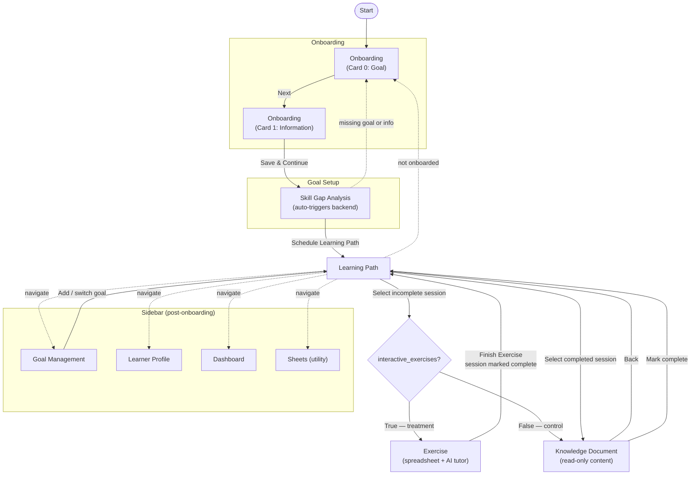

### Legend

| Style | Meaning |
|-------|---------|
| Solid arrow | Primary user-driven navigation |
| Dashed arrow | Sidebar access or guard redirect |
| Diamond `{...}` | Conditional branch (A/B cohort split) |

---

## Pages Summary

| Page | File | Role |
|------|------|------|
| Onboarding | `pages/onboarding.py` | Two-card wizard: goal entry + learner info |
| Skill Gap Analysis | `pages/skill_gap.py` | Auto-runs backend, shows editable skill gap cards |
| Learning Path | `pages/learning_path.py` | Session grid, main hub after onboarding |
| Exercise | `pages/exercise.py` | Treatment cohort: spreadsheet + AI tutor chat |
| Knowledge Document | `pages/knowledge_document.py` | Control cohort + completed session review |
| Goal Management | `pages/goal_management.py` | Add / switch / edit goals |
| Learner Profile | `pages/learner_profile.py` | View background, progress, preferences |
| Dashboard | `pages/dashboard.py` | Analytics: progress, mastery rate, timeseries |
| Sheets | `pages/sheets.py` | Utility for generating synthetic spreadsheet data |

---

## C4 Level 3 — Per-Page Interaction Diagrams

Each diagram uses three participants: **User**, the **Page** (Streamlit), and the **Backend** (FastAPI at `localhost:5000`). Arrows show temporal sequence: user action → page logic → backend round-trip. Dashed return arrows are backend responses.

---

### 1. Onboarding — `pages/onboarding.py`

A two-card wizard that collects the learner's goal and background before any other page is accessible. Card 0 captures the goal (with optional AI refinement); Card 1 captures occupation, optional resume PDF, and study preferences. On "Save & Continue" the data is written to session state and the user is forwarded to Skill Gap.

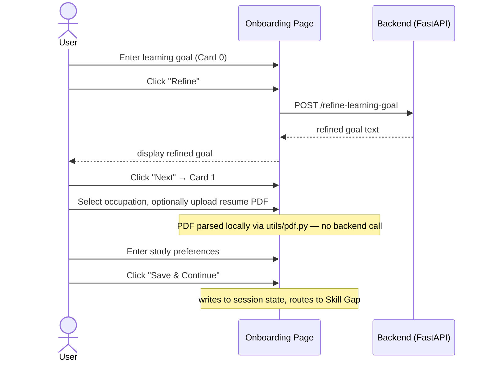

| Method | Route | Trigger | Helper |
|--------|-------|---------|--------|
| POST | `/refine-learning-goal` | "Refine" button (Card 0) | `refine_learning_goal` |

---

### 2. Skill Gap Analysis — `pages/skill_gap.py`

Automatically runs skill-gap identification when first visited (no user trigger needed). Displays editable skill cards where the user can adjust required/current proficiency levels and toggle individual gaps. "Schedule Learning Path" commits the gap data, creates the learner profile, and routes forward.

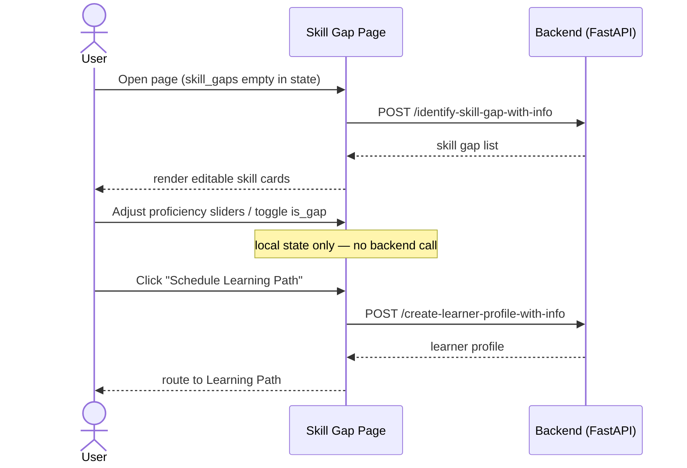

| Method | Route | Trigger | Helper |
|--------|-------|---------|--------|
| POST | `/identify-skill-gap-with-info` | Page load when `skill_gaps` empty | `identify_skill_gap` |
| POST | `/create-learner-profile-with-info` | "Schedule Learning Path" when profile empty | `create_learner_profile` |

---

### 3. Learning Path — `pages/learning_path.py`

The main hub after onboarding. Auto-schedules sessions on first visit. Shows a grid of sessions with per-session action buttons. Incomplete sessions route to either Exercise (treatment) or Knowledge Document (control) depending on `config.interactive_exercises`. An expander allows re-scheduling with a custom session count.

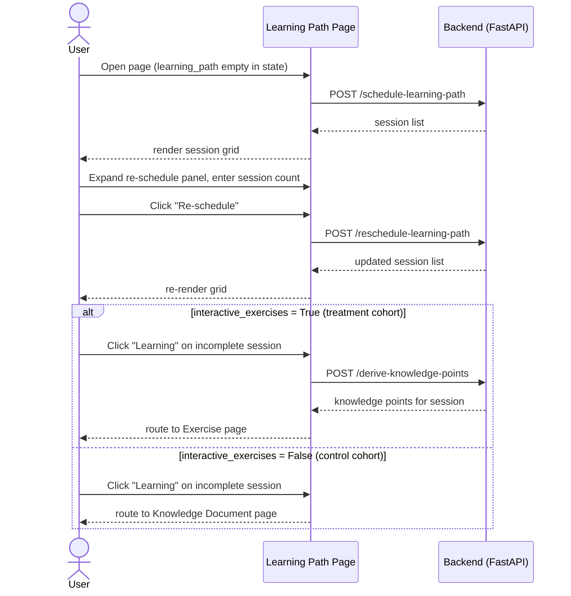

| Method | Route | Trigger | Helper |
|--------|-------|---------|--------|
| POST | `/schedule-learning-path` | Page load when `learning_path` empty | `schedule_learning_path` |
| POST | `/reschedule-learning-path` | "Re-schedule" button | `reschedule_learning_path` |
| POST | `/derive-knowledge-points` | "Learning" button — treatment cohort only | `derive_knowledge_points` |

---

### 4. Exercise — `pages/exercise.py`

The treatment cohort's interactive learning surface. Two sequential phases: **Brainstorming** (conversational negotiation of what to practice) and **Exercise** (live spreadsheet work with AI tutor guidance). Embeds the Univer Sheets iframe; reads sheet snapshots back via `streamlit_js_eval`.

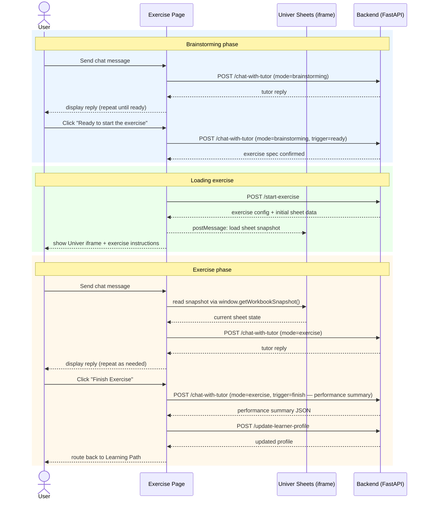

| Method | Route | Trigger | Helper |
|--------|-------|---------|--------|
| POST | `/chat-with-tutor` (mode=`brainstorming`) | Each chat message + "Ready to start" | `chat_with_tutor_exercise` |
| POST | `/start-exercise` | Entering loading phase after brainstorming | `start_exercise` |
| POST | `/chat-with-tutor` (mode=`exercise`) | Each chat message + "Finish Exercise" (×2) | `chat_with_tutor_exercise` |
| POST | `/update-learner-profile` | "Finish Exercise" after performance summary parsed | `update_learner_profile` |

---

### 5. Knowledge Document — `pages/knowledge_document.py`

The control cohort's (and completed-session) read path. On first visit with no cached document, runs a 4-stage backend pipeline to build the learning document and quizzes. The user reads the document, answers quizzes, then completes the session and optionally submits feedback — both actions update the learner profile.

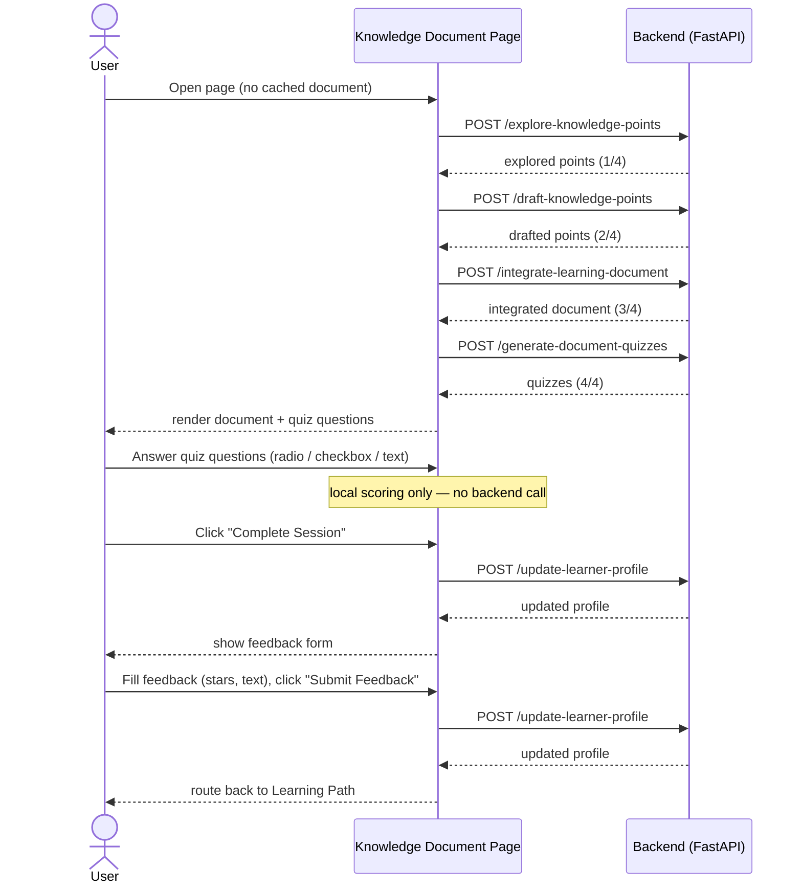

| Method | Route | Trigger | Helper |
|--------|-------|---------|--------|
| POST | `/explore-knowledge-points` | Page load, no cached doc — stage 1/4 | `explore_knowledge_points` |
| POST | `/draft-knowledge-points` | Page load, no cached doc — stage 2/4 | `draft_knowledge_points` |
| POST | `/integrate-learning-document` | Page load, no cached doc — stage 3/4 | `integrate_learning_document` |
| POST | `/generate-document-quizzes` | Page load, no cached doc — stage 4/4 | `generate_document_quizzes` |
| POST | `/update-learner-profile` | "Complete Session" and "Submit Feedback" | `update_learner_profile` |

---

### 6. Goal Management — `pages/goal_management.py`

Allows the user to add new goals (with optional AI refinement), switch the active goal, or edit and delete existing ones. Opening the "Skill Gap" dialog for a new goal triggers a fresh skill-gap analysis and profile creation, effectively restarting the learning path for that goal.

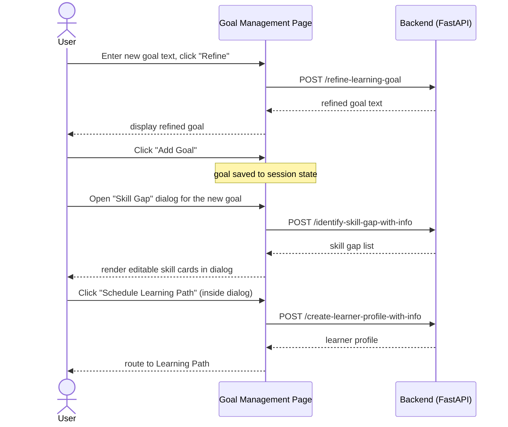

| Method | Route | Trigger | Helper |
|--------|-------|---------|--------|
| POST | `/refine-learning-goal` | "Refine" button | `refine_learning_goal` |
| POST | `/identify-skill-gap-with-info` | Skill Gap dialog opens with empty skill gaps | `identify_skill_gap` |
| POST | `/create-learner-profile-with-info` | "Schedule Learning Path" inside dialog | `create_learner_profile` |

---

### 7. Learner Profile — `pages/learner_profile.py`

Read-only view of the learner model: background info, active goal, cognitive status, preferences, and behavioral patterns. Includes a feedback form (rating stars, text suggestions, optional PDF) that triggers a profile update on submit. A fallback call to create the profile fires only if rendering throws an exception.

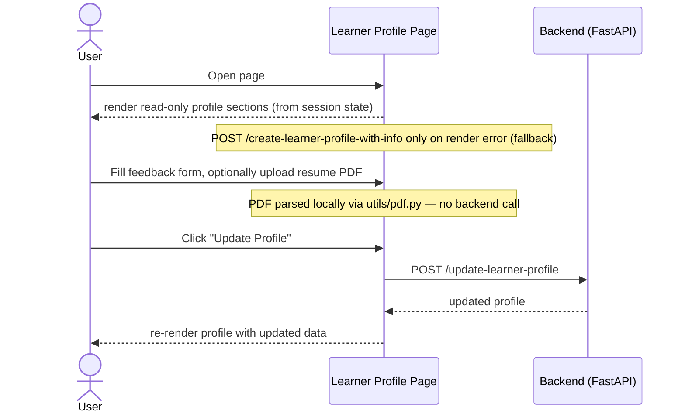

| Method | Route | Trigger | Helper |
|--------|-------|---------|--------|
| POST | `/update-learner-profile` | "Update Profile" button | `update_learner_profile` |
| POST | `/create-learner-profile-with-info` | Render-error fallback only | `create_learner_profile` |

---

### 8. Dashboard — `pages/dashboard.py`

Read-only analytics page. All data is drawn from session state computed locally; no backend calls are made. Renders a progress bar, a selectable Plotly skill radar chart, a bar chart of per-session time, and a line chart of mastery history over time.

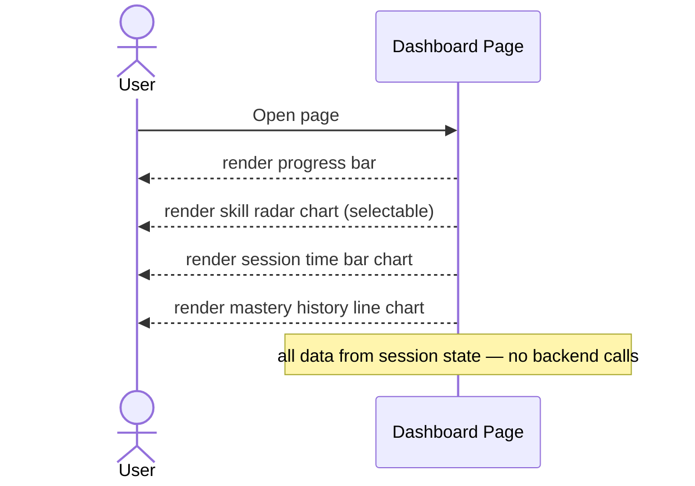

*No backend endpoints.*

---

### 9. Sheets — `pages/sheets.py`

Utility page for generating synthetic spreadsheet data via LLM. Embeds a Univer Sheets iframe. When the user enters a plain-text prompt, the backend generates structured JSON that is posted to the iframe. If the input is already valid JSON it is posted directly. Supports JSON file re-import and Univer's built-in "Export JSON / CSV" downloads.

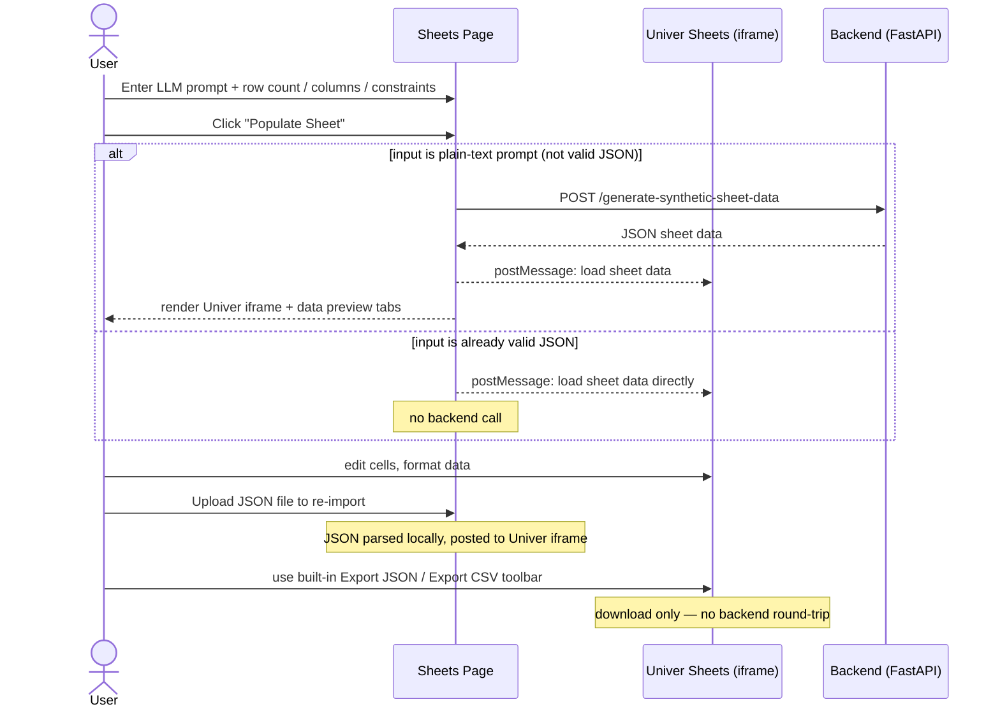

| Method | Route | Trigger | Helper |
|--------|-------|---------|--------|
| POST | `/generate-synthetic-sheet-data` | "Populate Sheet" when input is plain-text prompt | `generate_synthetic_sheet_data` |

---

### Cross-cutting: Global Floating Chatbot

Mounted once in `frontend/main.py` (not inside any individual page). Visible on all pages after onboarding completes. Calls the general RAG-backed tutor endpoint in default mode on each user message.

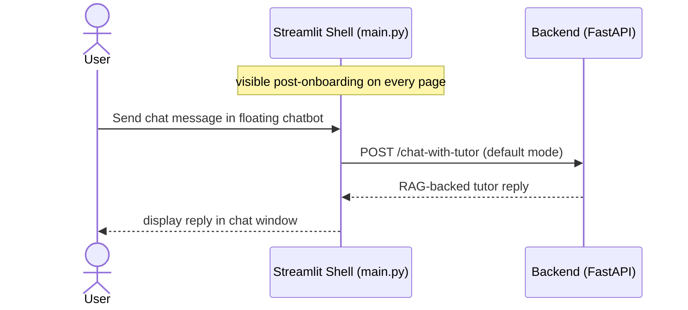

| Method | Route | Trigger | Helper |
|--------|-------|---------|--------|
| POST | `/chat-with-tutor` | Any user message in the global chatbot | `chat_with_tutor` |
